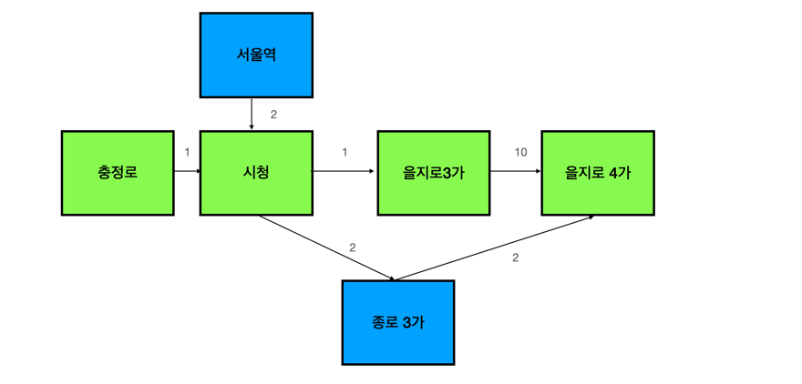

# jwp-subway-path

## 미션 요구사항
- 1주차 : 지하철 노선에 구간 추가, 삭제 기능, 조회 기능 수정
- 2주차 : 최단 경로 조회 기능
- 선택 : 가장 빠른 경로 조회 기능

## 1주차
### 주차 요구사항
- [x] 노선에 역 등록 API 신규 구현
- [x] 노선에 역 제거 API 신규 구현
- [x] 노선 조회 API 수정
- [x] 노선 목록 조회 API 수정
- [x] 통합 테스트
- [x] 단위 테스트

### 설계
- 역 간 연결
   - 다음 역
      - Station 객체 
   - 거리
      - Distance 객체
      - 어느 역에 연결되느냐에 따라 다름 (Station 객체로 표현 불가)
   - 방향성
      - 이동 가능한 방향만 그래프에 담기
   > 새 객체 생성 (Section)  
   > 필드 : 다음역(Station), 거리(Distance)

  
- 그래프
  > 객체 명 : SubwayGraph  
  > key : Station (역)  
  > value : List Section (이동 가능 구간)  

### 단위 기능 목록

1. 도메인 구현
- [x] Distance 구현
- [x] Section 구현
- [x] SubwayGraph 구현
- [x] 그래프에 값 추가
- [x] 그래프에 값 삭제
- [x] 그래프 조회

2. 영속성 계층 구현
- [x] Section 등록
- [x] Section 조회
- [x] Section 수정
- [x] Section 삭제

3. 웹 계층 구현
- [x] 구간 추가
- [x] 구간 삭제
- [x] 구간 조회

4. 서비스 계층 구현
- [x] 구간 추가
- [x] 구간 삭제
- [x] 구간 조회

---

## 2주차
### 요구사항
- [x] 경로 탐색 기능 추가
- [ ] 요금 조회 기능 추가

-  요금 계산 방법
  - 기본운임(10㎞ 이내): 기본운임 1,250원
  - 이용 거리 초과 시 추가운임 부과
     - 10km~50km: 5km 까지 마다 100원 추가
     - 50km 초과: 8km 까지 마다 100원 추가

---
- 테스트 상황

